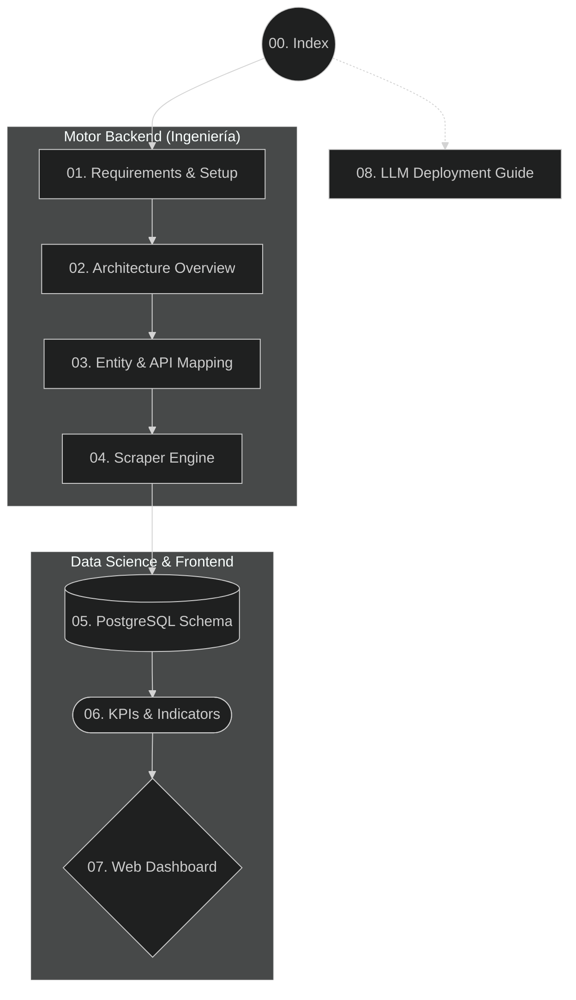

# 00. Índice Maestro y Ruta de Aprendizaje

Bienvenido al esquema de la Infraestructura Documental del **Kommo Chat Scrapper V4**. Debido a la enorme complejidad del sistema (que unifica Microservicios Backend, Scraping Headless, Motores de Postgres y Analítica Front-end), el manual se ha fracturado en **8 Documentos Modulares**.

Este archivo actúa como tu brújula para entender en qué orden debes digerir la información.

---

## 🗺️ Mapa del Directorio de Documentación (`docs/`)

---

## 📖 ¿Qué encontrarás en cada documento? (Revisión Genérica)

1. **[01_requirements_setup.md](./01_requirements_setup.md)**
   > **¿Para qué sirve?:** Contiene las instrucciones absolutas para infraestructura y herramientas. Entenderás cómo instalar Google Chrome WebDriver, cómo armar tu `.env` sin Hardcodings y por qué es letal el Autenticador (2FA) en la cuenta Kommo del scraper.
2. **[02_architecture_overview.md](./02_architecture_overview.md)**
   > **¿Para qué sirve?:** Muestra el "Big Picture". El gráfico colosal explicándote por qué decidimos crear un ambiente Híbrido (Usar API solo para rastrear fechas, y usar Selenium solo para capturar el historial sin morir en el intento).
3. **[03_api_and_entity_mapping.md](./03_api_and_entity_mapping.md)**
   > **¿Para qué sirve?:** Explica cómo el motor viaja de un insignificante evento (`event_type: incoming_message`) a sacar el `contact_id`, el Nombre del contacto, resolver su huso horario dinámicamente y computar una URL válida de kommo.com.
4. **[04_scraper_engine.md](./04_scraper_engine.md)**
   > **¿Para qué sirve?:** ¡El corazón extractivo! Explica detalladamente cómo nuestro código Javascript insertado evade la virtualización de memoria de Kommo (`window.__chatAccumulator`) mientras hace clicks visuales en "Cargar Mensajes", detectando por HTML puro si un mensaje es de un bot o una nota de voz.
5. **[05_database_schema.md](./05_database_schema.md)**
   > **¿Para qué sirve?:** Ingeniería de Datos profunda. Explicativo de la base Relacional de 10 tablas, la mecánica mágica UPSERT (para evitar filas duplicadas tras un crasheo) y la transformación LLM del registro a un formato texto (Conversations Compiled).
6. **[06_kpis_and_indicators.md](./06_kpis_and_indicators.md)**
   > **¿Para qué sirve?:** Explicación explícita de Algoritmos Corporativos. ¿Cómo hace Python matemáticamente para saber que un cliente "fue ignorado" o que hubo contacto orgánico de retorno cruzando mensajes `IN` y `OUT`?
7. **[07_web_dashboard.md](./07_web_dashboard.md)**
   > **¿Para qué sirve?:** Guía visual. Cómo la tabla pre-agregada se acopla a tu Flask y Jinja2 y despliega hermosos Bar-Charts renderizando `bot_only` vs `attended`.
8. **[08_llm_deployment_guide.md](./08_llm_deployment_guide.md)**
   > **¿Para qué sirve?:** ¿No quieres codear? Aquí yace el Sistema Estructural de un **Prompt**. Cópialo, dáselo a Claude/Gemini, y él levantará toda esta red en tu máquina automáticamente preguntándote exclusivamente por las contraseñas.
