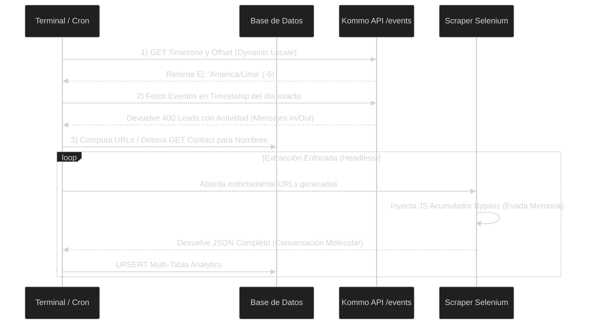

# 02. Arquitectura General y Lógica Operacional Híbrida

El **Kommo Chat Scrapper V4** abandona el arcaísmo de crear una Sesión Selenium y hacer "Scroll" a ciegas durante 5 horas tratando de encontrar chats para actualizar. Esta práctica consumía enormes picos de RAM, terminando en la desconexión inminente por *Out of Memory (OOM)*.

La gran solución ha sido bifurcar el comportamiento adoptando una **Postura Híbrida**.

---

## 🧠 Flujo de Análisis Híbrido: API Edge vs Headless Engine

### 1. Fase Ligera (Discovery API Edge)
Aprovechamos que los servidores de Kommo pueden escupir miles de datos en milisegundos mediante Endpoints JSON (`/api/v4/events`). 
* ¿Para qué sirve esto? Le permite a nuestro servidor crear un mapa calórico. En cuestión de 5 segundos sabemos que el **Lead X** y el **Lead Y** conversaron el día de hoy, y que debemos obviar olímpicamente a los otros 25,000 Leads estancados.

### 2. Fase Pesada (Headless Edge)
Con la hoja de cacería en mano (el Array de URLs computadas por la API), instanciamos el motor hambriento de procesador: Google Chrome.
La ventaja monumental de este pipeline es que si en un día Kommo tuvo 1 mensaje, Chrome Headless va a trabajar *exactamente 1 segundo*. Ahorra gigabytes de computación en el servidor final en relación a los scrapers obsoletos.
