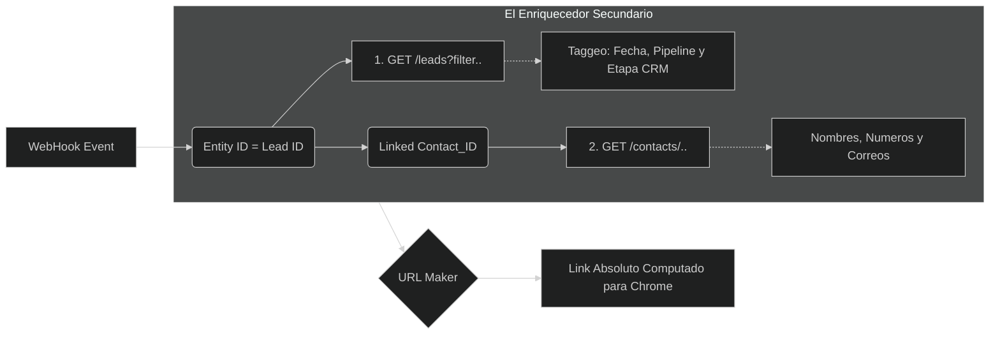

# 03. Ruteo Dinámico API y Mapeo Celular

Nuestra lógica es anti-quemado (Anti-Hardcoding). Por eso utilizamos rutinas dinámicas nativas (consultas al CRM) antes de pre-computar cualquier matriz u ordenamiento interno.

---

## 1. Detección Localizada (`Huso Horario Dinámico`)
A diferencia de otros scripts encajonados en una métrica (pej. `UTC-5` fijo), nuestra Fase de Ruteo arranca ejecutando un *ping* genérico hacia `GET /api/v4/account`. 

El Objeto JSON de la cuenta Kommo retorna una metavariable `timezone` dictaminando con exactitud quirúrgica la geolocalización de ese cliente en particular (`America/Lima`, `Europe/Madrid`, etc). Al alimentarlo a la clase `zoneinfo` de Python (3.9+), calculamos un salto de `Offset` exacto y trazamos un margen de Segundos UNIX que delimite de 00:00 a las 23:59 del objetivo con perfección estricta, evitando extraer chats de "Ayer" mezclados con "Hoy".

---

## 2. El Pipeline Enriquecedor de Entidades (Mapping)
¿Cómo sabe la base de datos armar su modelo, si el Evento API nos da una fría variable anidada como `"entity_id" : 32299881`?

Utilizamos el sistema modular incrustado en **`scripts/extract_mappings.py`** y métodos *Enrichment*. El flujo se dispara en cascada y luce de la siguiente forma interna de base de datos relacional nativa de Kommo: 

### Endpoints Ancla 
- **`GET /api/v4/leads/pipelines`**: En vital para analíticas futuras. Un lead te dará que habita en el pipeline `334`, pero nuestra lógica cruza que la `334` corresponde al embudo "Soporte Técnico" en sus descripciones.
- **`GET /api/v4/leads/custom_fields`**: Traducimos un ID a UTM. Un array como `cf_433` internamente es el `utm_source_campaign` del Lead generado por Marketing AdSense.
- **Consumo Totalizador**: Durante el escáner de la cola del Webhook en `collect_targets_via_api`, tomamos la radical decisión de Extraer **Todo**. Cada lead listado es un target empujado a Selenium; omitiendo los antiguos filtros anti-spam, garantizando una ingesta holística en la Data Base final.
