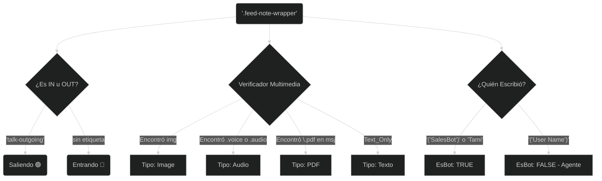

# 04. El Motor Scraper (Selenium & Acumulador Virtual DOM)

Kommo CRM implementa para su Interfaz Gráfica una Arquitectura SPA (Single Page Application) basada en memorias efímeras de React/Vue (Virtualizado).
Esto significa que nunca hay 500 mensajes cargados detrás tuyo: Si haces Scroll Hacia arriba, el nodo de tu HTML que estaba abajo *SE ELIMINA TEMPORALMENTE*. El Scraper clásico moriría aquí; o captura solo lo de abajo, o lo de arriba, nunca todo.

---

## 1. La Inyección Acumuladora Frontend (Bypass)

Para romper su arquitectura y rescatar historias completas creamos una capa paralela al render de Kommo con `driver.execute_script`:

```javascript
// La magia central del Scraper en el núcleo Chrome:
window.__chatAccumulator = window.__chatAccumulator || new Map();
```

Cada iteración en Python da Cliks masivos al botón *"Cargar X Más"*, y en milisegundos corre nuestro analizador. Todos los nuevos bloques de HTML mostrados entran como Objetos al Map y **Allí se asientan.** Si Kommo los "borra" de la vista HTML al Scrollear... nosotros **aún los contenemos** en la caché de tu memoria Ram. ¡Fuga masiva solucionada!.

---

## 2. Árbol y Clasificación de Nodos Nativos (CSS Regex)

No inyectamos basura de CSS. El Javascript local tiene bucles nativos extraídos por nosotros que comprenden **qué** es un globo de texto en base a su envoltorio (Wrapper):



### Prevenir Pérdidas de Memoria
Kommo CRM en ocasiones inyecta fotografías en Binario de Base64 puros directamente al Chat. Estos strings miden arriba de 10 megabytes. El Scraper posee un límite tajante de corte (`substring(1500)`) del nodo mensaje, impidiendo caídas locales estruendosas.

---

## 3. Alerta De Bloqueos Anti-Bot (Caché Freeze)
Suelen surgir escenarios tras cientos de escaneos, donde Chromedriver rebota el error `SessionNotCreatedException` o la pantalla explota congelada. 

* **La Razón**: El entorno Google del Headless cruzó una heurística de actividad inusual.
* **El Solucionador Práctico**: La instrucción es suspender temporalmente el framework. Iniciar Google Chrome en tu PC, Iniciar la URL de Kommo, ingresar el Password allí *visualmente*. Ocasionalmente forzar un "Reset" de Clave. Cambiar tu archivo `.env` manual, y volver el Chrome local al framework. Se saneará y autorizará por otro ciclo indefinido.
