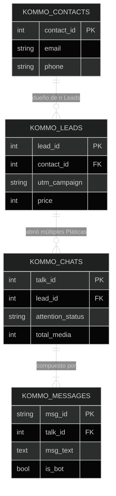

# 05. Modelado Estructural, Tablas Relacionales (PostgreSQL)

Almacenar un ecosistema como un "Hash crudo" en NoSQL impediría escalabilidad gerencial analítica. Construimos 10 esquemas puristas que fragmentan el todo al mínimo común múltiplo.

## 1. Patrón Defensivo de Insersiones (UPSERT Constraint)
El *Crawler* (Kommo Chat Scrapper) se levanta diario o por hora. Si ejecutara un comando "INSERT" base, terminaríamos alojando 4 veces el mismo contacto en un mes. 

Por regla arquitectónica inviolable, el Servidor enruta todo dato contra el comando Postgres `ON CONFLICT DO UPDATE SET`. 
Si el `Contact_ID` entra y **ya existe**: sus campos históricos base quedan inmóviles y el motor actualiza las llaves volátiles como su *Updated_At* u *Offline Changes Stage*.

## 2. Mapa Primario Entidad-Relación (E-R)

## 3. Matriz de Variables de Negocios Extraídas
* **Tabla `kommo_chats`**: Aquí yace la vida estadística para Dashboards rápidos. Totaliza por Lead, cuántas fotos (`total_media`), Inbounds orgánicos y Outbounds se manifestaron de un solo golpe.
* **Tabla `kommo_messages`**: Estrictamente molecular (ID compuesto: `talk_id`, `chat_date`, `msg_index`). Exigido para disecciones minuciosas temporales.
* **Tabla `kommo_stage_changes`**: Registros mudos de Eventos analíticos desde el API. Traza con alta especificidad "Quién, y en Qué Día" movió un negocio particular al cajón "Venta Ganada" vs "Venta Perdida".
