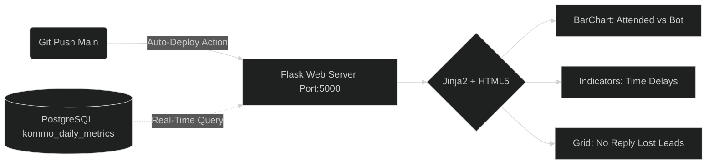

# 07. Integración, Despliegue y Dashboard WEB

La infraestructura de Base de Datos es leída finalmente por nuestro motor de visualización abstraído vía *Flask*. Este módulo está enclavado en `web/app.py`.

## Estructura Local de Conexiones
Flask se conectará por defecto usando un ORM nativo a la misma string `DATABASE_URL` del entorno general del Scraper.

## 1. Módulo Gráfico Base
El estilo visual de inyección (`templates/`) asume el control cargando bibliotecas como Bootstrap y Chart.js en formato oscuro (Dark-Mode) o Adaptativo.
* Las vistas principales asientan las divisiones de la tabla `daily_metrics`. No calcula gigabytes en tiempo real, sino que pide la columna de la sumatoria diaria pre-ensamblada (Por eso es hiper veloz).

## 2. CI/CD GitHub Connection
Para hacer de esto un servicio perenne como un SaaS:
- Se sugiere crear tu propia organización Github.
- Configurar tu clave secreta de Postgre en GitHub Secrets como `DATABASE_URL`.
- Levantar un Pipeline que construya la imagen Python nativa (Dockerfile sugerido en raíz) inyectándole las variables y exponiendo tu Webapp al público con SSL (Railway o Render.com).
